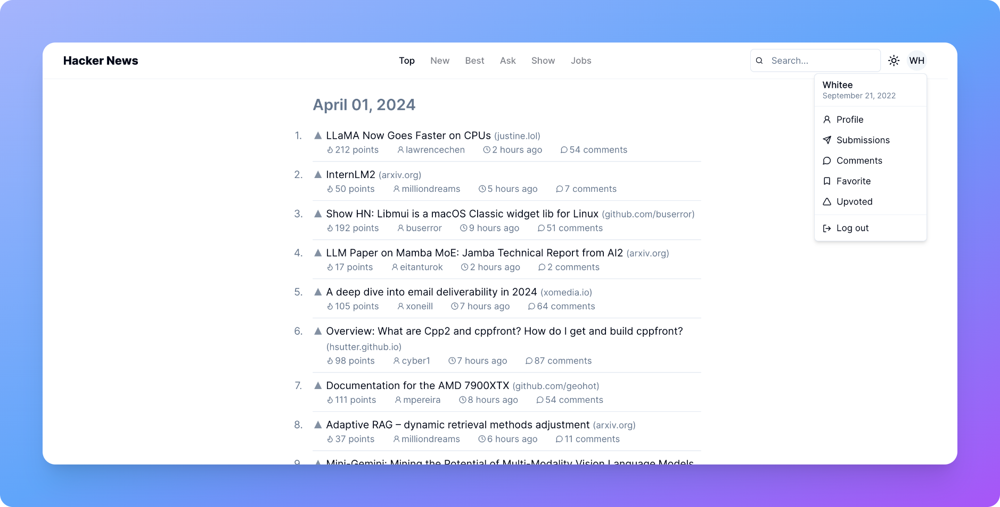
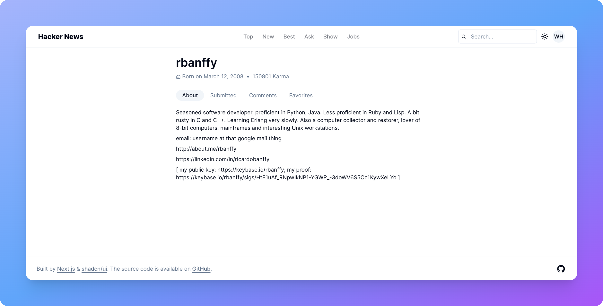
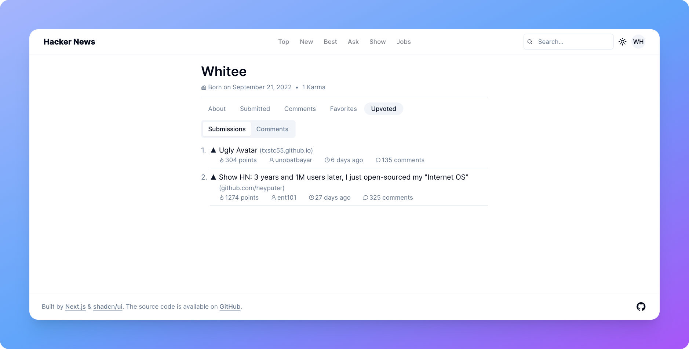
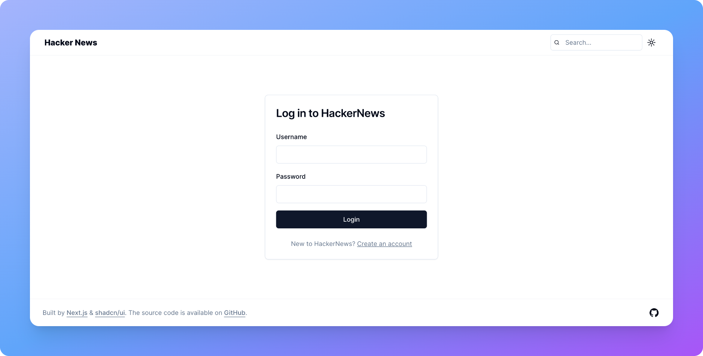
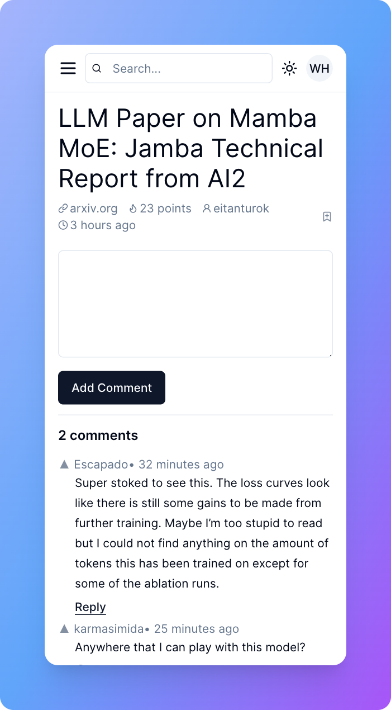
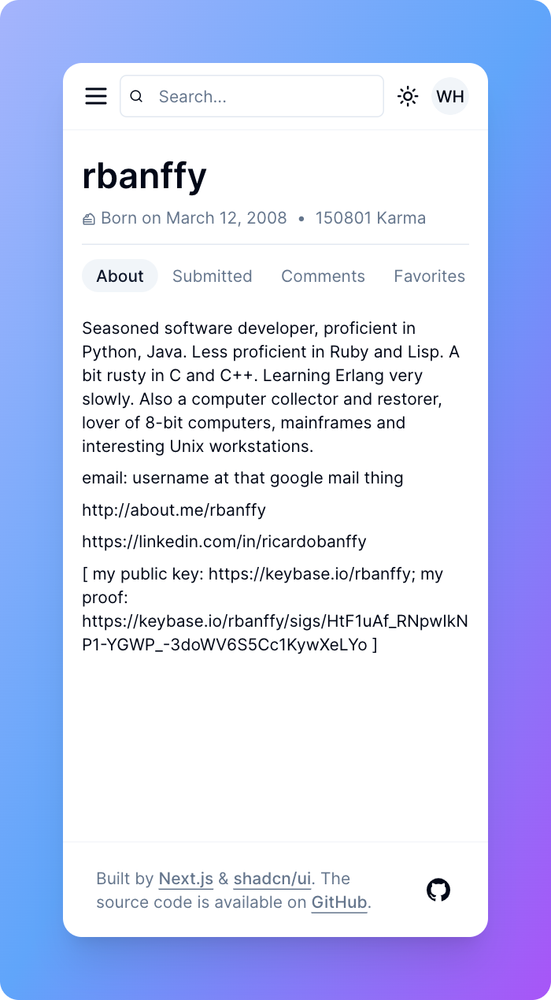
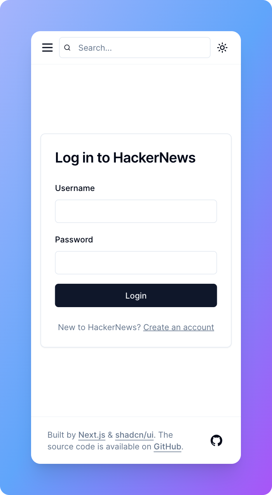

# Next.js HackerNews
This is a [HackerNews](https://news.ycombinator.com/) clone built with [Next.js](https://nextjs.org/) and [shadcn/ui](https://ui.shadcn.com/).



<p style="text-align: center;"><a target="_blank" href="https://nextjs-hackernews-omega.vercel.app">Live Demo</a></p>

## Features

- Next.js App Router
- React Server Components (RSCs) and Suspense
- Server Actions for mutations
- Beautifully designed components from shadcn/ui
- Styling with Tailwind CSS
- Browse stories: Top, Newest, Best, Show, Ask, Jobs.
- Search for stories.
- User authentication: Create an account or log in using your Hacker News account to access personalized features.
- Mark stories as favorite.
- Upvote stories or comments.
- Add comments.
- View user profile: About, Submitted, Comments, Favorites, Upvoted(private).
- Responsive design: Friendly to both mobile and desktop.
- Automatic light/dark mode based on system settings.

## Screenshots

### Desktop










### Mobile
<div style="display: inline-block">
  
  
</div>
<br />
<div style="display: inline-block; margin-top: 18px">
  
  
</div>
<br />
<div style="display: inline-block; margin-top: 18px">
  
  
</div>

## Running Locally

Requires Node.js 18.17 or later.

0. Clone the project.
```bash
git clone https://github.com/WhiteDG/nextjs-hackernews.git

cd nextjs-hackernews
```

1. Install dependencies.
```bash
pnpm install
```
2. Copy `.env.example` to `.env.local` and update the variables.
```bash
cp .env.example .env.local
```
3. Run the development server with hot reload.
```bash
pnpm dev
```
4. Open [http://localhost:3000](http://localhost:3000) with your browser to see the result.

5. Build for production
```bash
pnpm run build
```

6. Serve in production mode
```bash
pnpm start
```

## APIs
This project leverages the power of various APIs to provide an enriched user experience:
- [HackerNews Official API](https://github.com/HackerNews/API)
  - Get stories
  - Get comments
  - Get user profiles
- [HackerNews Website](https://news.ycombinator.com)
  - Login/create account
  - Add comments
  - Upvote
  - Favorite
  - Submitted, Comments, Favorites, Upvoted(private)
- [HnAlgolia API](https://hn.algolia.com/api)
  - Search


## License
Licensed under the [MIT license](https://github.com/WhiteDG/nextjs-hackernews/blob/main/LICENSE).
